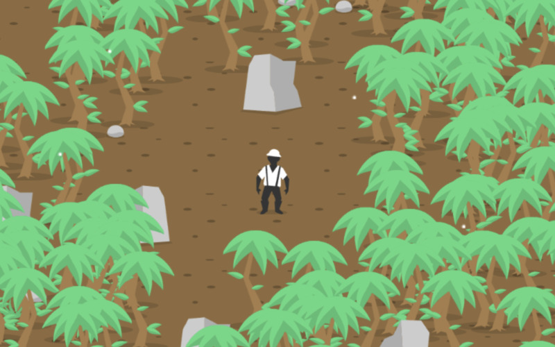

# Lost City of S

In search of the lost city of S, S for superstition, where exactly that was
invented, as legend has it. And to this day, a mishap happens here every 13
seconds.

A quick running game in 13 kilobytes for [js13kGames][js13kgames] 2024.
The theme was "[Triskaidekaphobia][triskaidekaphobia]".

Play it [here][play].

Works on your phone, too.

## Build Requirements

[esbuild][esbuild] is used for minification. You can get it with `npm`:

	$ npm install --global esbuild

[js13kgames]: http://js13kgames.com/entries/2024
[triskaidekaphobia]: https://en.wikipedia.org/wiki/Triskaidekaphobia
[play]: https://hhsw.de/sites/proto/js13k2024/
[esbuild]: https://github.com/evanw/esbuild
